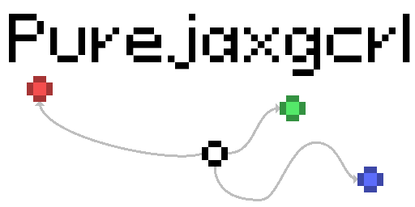
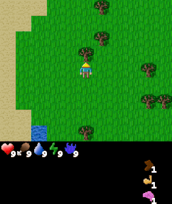
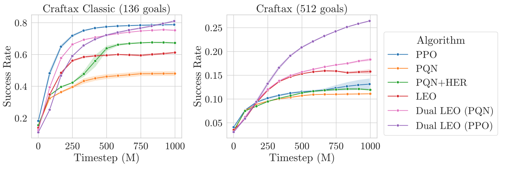
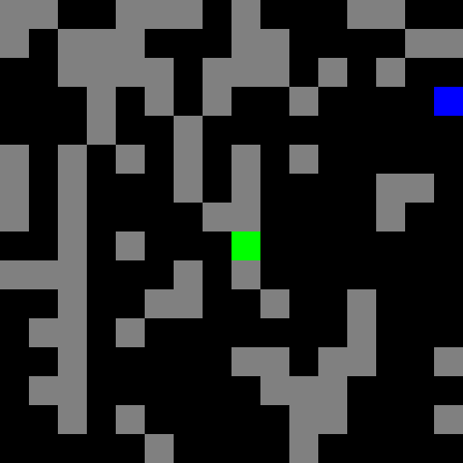
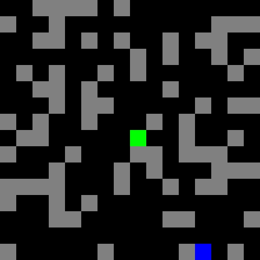
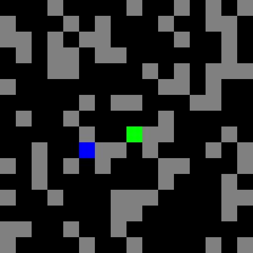

<p align="center">
 
</p>

<p align="center">
        <a href= "https://pypi.org/project/craftax/">
        </a>
       <a href= "https://github.com/MichaelTMatthews/purejaxgcrl/blob/main/LICENSE">
        </a>
       <a href= "https://www.mtmatthews.com/blog/leo/">
        </a>
       <a href= "https://arxiv.org/abs/2605.23551">
        </a>
       <a href= "https://github.com/astral-sh/ruff">
        </a>
</p>

# ⛳ Purejaxgcrl
The official repository for "Goal-Conditioned Agents that Learn Everything All at Once" (ICML 2026) [(paper)](https://arxiv.org/abs/2605.23551).

Purejaxgcrl is a framework for goal conditioned reinforcement learning in end-to-end [JAX](https://github.com/jax-ml/jax), with a focus on discrete action environments with finite goal sets.
We take the base PPO implementation from [purejaxrl](https://github.com/luchris429/purejaxrl) and PQN implementation from [purejaxql](https://github.com/mttga/purejaxql) and adapt them for goal-conditioned RL. We additionally implement Hindsight Experience Replay, LEO, Dual LEO (PQN) and Dual LEO (PPO).

# ⛏️ Craftax

We define a large goal set over Craftax: 136 goals for Craftax-Classic and 512 goals for Craftax.

<table align="center">
  <tr>
    <td align="center"></td>
    <td align="center"></td>
    <td align="center"></td>
  </tr>
  <tr>
    <td align="center"><b>Goal #114</b> <br> <i>inventory/stone_40-44</i><br/><b>Collect between 40-44 stone</b></td>
    <td align="center"><b>Goal #208</b> <br> <i>block_map/water_up</i><br/><b>Stand below water</b></td>
    <td align="center"><b>Goal #492</b> <br> <i>dungeon_level/dlvl_1</i><br/><b>Reach the first dungeon level</b></td>
  </tr>
</table>

The above videos show a Dual LEO (PPO) agent completing selected goals.

We provide clean single-file implementations for all methods evaluated in the LEO paper, with verified performances on Craftax as shown, averaged over all goals.

<p align="center">
 
</p>

The complete goal set listing is available for [Craftax-Classix](envs/craftax/goal_listing_craftax_classic.txt) and [Craftax](envs/craftax/goal_listing_craftax.txt), with more details in the manuscript appendices. 

# ⬜ Gridworld

For interpretable and fast results we also include a simple goal-conditioned gridworld environment, for which an expert agent can be trained in under a minute.

<p align="middle">
  
  
  
</p>

# ⬇️ Installation

```commandline
git clone https://github.com/MichaelTMatthews/purejaxgcrl.git
cd purejaxgcrl
pre-commit install
pip install -r requirements.txt
```

We have developed and tested on `jax==0.6.0`.

# 📜 Basic Usage

To reproduce the Craftax experiments from the manuscript run the following commands. All the default arguments are set to the hyperparameter tuned values found in the paper.
All scripts are single-file implementations following in the spirit of purejaxrl, and are designed to be easily hackable.

```commandline
python ppo.py  # PPO
python pqn.py --her_mode none  # PQN
python pqn.py --her_mode mixed --minibatch_size 2048 --lr 0.0001  # PQN+HER
python leo.py  # LEO
python dual_leo_pqn.py  # Dual LEO (PQN)
python dual_leo_ppo.py  # Dual LEO (PPO)
```

You can also find the relevant wandb sweeps in `sweeps/`.

The scripts currently permit the possible environments `Craftax-Symbolic-v1, Craftax-Classic-Symbolic-v1, Gridworld-v1`.
So to run gridworld experiments run, for example:

```commandline
python ppo.py --env_name Gridworld-v1
```

To visualise a trained policy, run with the `--save_policy` flag. At the end of training a message will be printed like
```
saved PPO train state to .../wandb/.../files/policies
```

You can then visualise the trained policy in the pygame renderer by running the following. Note that the path only goes up to `.../files` NOT the `policies` directory.
```commandline
python analysis/craftax/view_agent.py --path .../wandb/.../files
```

You can also play yourself in the environments using
```commandline
python analysis/craftax/play_craftax_gc.py
python analysis/gridworld/play_gridworld.py
```

# 🔎 See Also
- 🦾 [jaxgcrl](https://github.com/michalbortkiewicz/jaxgcrl) Continuous control GCRL in Jax.
- ⚡ [PureJaxRL](https://github.com/luchris429/purejaxrl) End-to-end RL implementations in Jax.
- ⛏️ [Craftax](https://github.com/MichaelTMatthews/Craftax) The Craftax benchmark.
- 🔥 [PureJaxQL](https://github.com/mttga/purejaxql) End-to-end DQN in Jax.


# 📚 Citation
If you use purejaxgcrl in your work please cite
```
@inproceedings{matthews2026leo,
    author={Michael Matthews and Matthew Jackson and Michael Beukman and Thomas Foster and Alistair Letcher and Scott Fujimoto and Cédric Colas and Jakob Foerster},
    title = {Goal-Conditioned Agents that Learn Everything All at Once},
    booktitle = {International Conference on Machine Learning ({ICML})},
    year = {2026}
}
```